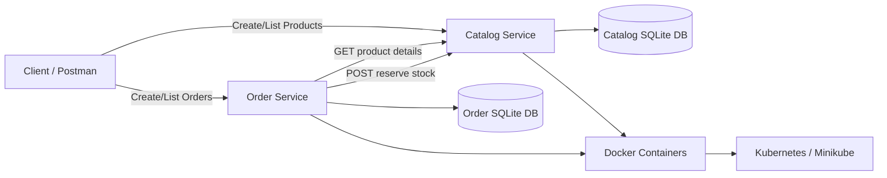

# Detailed Documentation: Online Store Microservices

## 1. Application Description

The selected application is a simple **Online Store Order Management System**. The purpose of the application is to allow users to view products and place orders. In a real online store, the complete system would include product management, inventory, orders, payments, shipping, notifications, and monitoring.

For this assignment, two core microservices are implemented:

- **Catalog Service**: maintains product information and product stock

    https://github.com/adityarj-pazuzu/catalog-service-scalable-assignment1
- **Order Service**: creates customer orders and communicates with the Catalog Service to validate products and reserve stock
    
    https://github.com/adityarj-pazuzu/order-service-scalable-assignment1


## 2. Design and Architecture

### 2.1 Architecture Style

The application follows a **microservices architecture**. 
Each service has a specific business responsibility and owns its own database. 
The services communicate through REST APIs over HTTP.

Main architecture decisions:

- Each service is independently developed.
- Each service can be deployed in a separate Docker container.
- Each service has its own database.
- The architecture makes the system scalable, maintainable, and allows independent development and deployment of services.
- The Order Service does not directly access the Catalog Service database.
- The Order Service calls Catalog Service APIs to check products and reserve stock.

### 2.2 Architecture Diagram



### 2.3 Service Responsibilities

| Service | Responsibility |
| --- | --- |
| Catalog Service | Create products, list products, get product details, update stock, reserve stock |
| Order Service | Create orders, list orders, get order details, call Catalog Service before saving orders |

### 2.4 Business Capabilities

| Business Capability | Microservice |
| --- | --- |
| Product catalog management | Catalog Service |
| Inventory management | Catalog Service |
| Order placement | Order Service |
| Order history | Order Service |

### 2.5 System Operations

Commands:

| Command | Service | Description |
| --- | --- | --- |
| Create product | Catalog Service | Adds a new product |
| Update stock | Catalog Service | Updates available stock |
| Reserve stock | Catalog Service | Reduces stock after order placement |
| Create order | Order Service | Creates a new customer order |

Queries:

| Query | Service | Description |
| --- | --- | --- |
| List products | Catalog Service | Returns all products |
| Get product | Catalog Service | Returns one product by ID |
| List orders | Order Service | Returns all orders |
| Get order | Order Service | Returns one order by ID |

### 2.6 Service Collaboration

When a customer places an order, the following steps happen:

1. Client sends a `POST /orders` request to the Order Service.
2. Order Service calls `GET /products/{product_id}` on the Catalog Service.
3. Catalog Service returns product details including price and stock.
4. Order Service checks if enough stocks are available.
5. Order Service calls `POST /products/{product_id}/reserve` on the Catalog Service.
6. Catalog Service reduces stock.
7. Order Service saves the order in its own SQLite database.
8. Order Service returns the created order response to the client.

## 3. Technologies Used

| Area | Technology |
| --- | --- |
| Programming language | Python 3.11 |
| Web framework | FastAPI |
| API server | Uvicorn |
| Database | SQLite |
| Service communication | REST over HTTP |
| Containerization | Docker |
| Orchestration | Kubernetes using Minikube |
| Testing client | Postman |

## 4. Project Structure

```text
### Microservice 1: Catalog Service
catalog-service/
    .github/
      workflows/
        ci.yml
    k8s/
      namespace.yaml
      deployment.yaml
    app/
      __init__.py
      main.py
    tests/
      test_catalog.py
    .pre-commit-config.yaml
    .dockerignore
    .gitignore
    Dockerfile
    README.md
    requirements.txt
    
### Microservice 2: OrderService  
order-service/
.github/
  workflows/
    ci.yml
k8s/
  namespace.yaml
  deployment.yaml
app/
  __init__.py
  main.py
tests/
  test_order.py
.pre-commit-config.yaml
.dockerignore
.gitignore
Dockerfile
README.md
requirements.txt
```

The `catalog-service` and `order-service` folders are separate Git repositories. 
Each service has its own README, tests, Dockerfile, pre-commit configuration, GitHub Actions workflow, and Kubernetes manifests. 


## 5. Implementation Steps

### 5.1 Catalog Service Implementation

1. Created a FastAPI application in `catalog-service/app/main.py`.
2. Added SQLite database initialization on application startup.
3. Created a `products` table with product ID, name, description, price, and stock.
4. Added API endpoints for product creation, listing, reading, stock update, and stock reservation.
5. Added request validation using Pydantic models.
6. Added a Dockerfile so the service can run inside a container.

### 5.2 Order Service Implementation

1. Created a FastAPI application in `order-service/app/main.py`.
2. Added SQLite database initialization on application startup.
3. Created `orders` and `order_items` tables.
4. Added API endpoints for creating orders, listing orders, and reading order details.
5. Added HTTP communication from Order Service to Catalog Service.
6. Before creating an order, the service checks product availability and reserves stock.
7. Added a Dockerfile so the service can run inside a container.

## 6. Local testing

### 6.1 Start Catalog Service

```bash
git clone https://github.com/adityarj-pazuzu/catalog-service-scalable-assignment1.git
cd catalog-service-scalable-assignment1
python -m venv .venv # or python3 depending on your system
.\.venv\Scripts\Activate.ps1
pip install -r requirements.txt
uvicorn app.main:app --host 0.0.0.0 --port 8001
```

Catalog Service runs at:

```text
http://localhost:8001
```

### 6.2 Start Order Service

Open a second terminal.

```bash
git clone https://github.com/adityarj-pazuzu/order-service-scalable-assignment1.git
cd order-service-scalable-assignment1
python -m venv .venv # or python3 depending on your system
.\.venv\Scripts\Activate.ps1
pip install -r requirements.txt
$env:CATALOG_SERVICE_URL="http://localhost:8001"
uvicorn app.main:app --host 0.0.0.0 --port 8002
```

Order Service runs at:

```text
http://localhost:8002
```

## 7. Postman Testing Steps and Expected Responses

### 7.1 Health Check: Catalog Service

Request:

```text
GET http://localhost:8001/health
```

Expected status:

```text
200 OK
```

Expected response:

```json
{
  "status": "ok",
  "service": "catalog-service"
}
```

### 7.2 Health Check: Order Service

Request:

```text
GET http://localhost:8002/health
```

Expected status:

```text
200 OK
```

Expected response:

```json
{
  "status": "ok",
  "service": "order-service"
}
```

### 7.3 Create Product

In Postman:

- Method: `POST`
- URL: `http://localhost:8001/products`
- Body type: `raw`
- Body format: `JSON`

Request body:

```json
{
  "name": "Laptop",
  "description": "Student laptop",
  "price": 55000,
  "stock": 10
}
```

Expected status:

```text
201 Created
```

Expected response:

```json
{
  "name": "Laptop",
  "description": "Student laptop",
  "price": 55000,
  "stock": 10,
  "id": 1
}
```

### 7.4 List Products

Request:

```text
GET http://localhost:8001/products
```

Expected status:

```text
200 OK
```

Expected response:

```json
[
  {
    "name": "Laptop",
    "description": "Student laptop",
    "price": 55000,
    "stock": 10,
    "id": 1
  }
]
```

### 7.5 Get Product By ID

Request:

```text
GET http://localhost:8001/products/1
```

Expected status:

```text
200 OK
```

Expected response:

```json
{
  "name": "Laptop",
  "description": "Student laptop",
  "price": 55000,
  "stock": 10,
  "id": 1
}
```

### 7.6 Update Product Stock

Request:

```text
PATCH http://localhost:8001/products/1/stock
```

Request body:

```json
{
  "stock": 15
}
```

Expected status:

```text
200 OK
```

Expected response:

```json
{
  "name": "Laptop",
  "description": "Student laptop",
  "price": 55000,
  "stock": 15,
  "id": 1
}
```

### 7.7 Create Order

Before this call, make sure the product with ID `1` exists in the Catalog Service.

In Postman:

- Method: `POST`
- URL: `http://localhost:8002/orders`
- Body type: `raw`
- Body format: `JSON`

Request body:

```json
{
  "customer_name": "Aditi",
  "items": [
    {
      "product_id": 1,
      "quantity": 2
    }
  ]
}
```

Expected status:

```text
201 Created
```

Expected response:

```json
{
  "id": 1,
  "customer_name": "Aditi",
  "status": "CREATED",
  "total_amount": 110000,
  "items": [
    {
      "product_id": 1,
      "product_name": "Laptop",
      "quantity": 2,
      "unit_price": 55000
    }
  ]
}
```

After this request, Catalog Service stock is reduced by `2`.

### 7.8 Verify Stock After Order

Request:

```text
GET http://localhost:8001/products/1
```

Expected status:

```text
200 OK
```

Expected response if stock was `15` before creating the order:

```json
{
  "name": "Laptop",
  "description": "Student laptop",
  "price": 55000,
  "stock": 13,
  "id": 1
}
```

### 7.9 List Orders

Request:

```text
GET http://localhost:8002/orders
```

Expected status:

```text
200 OK
```

Expected response:

```json
[
  {
    "id": 1,
    "customer_name": "Aditi",
    "status": "CREATED",
    "total_amount": 110000,
    "items": [
      {
        "product_id": 1,
        "product_name": "Laptop",
        "quantity": 2,
        "unit_price": 55000
      }
    ]
  }
]
```

### 7.10 Get Order By ID

Request:

```text
GET http://localhost:8002/orders/1
```

Expected status:

```text
200 OK
```

Expected response:

```json
{
  "id": 1,
  "customer_name": "Aditi",
  "status": "CREATED",
  "total_amount": 110000,
  "items": [
    {
      "product_id": 1,
      "product_name": "Laptop",
      "quantity": 2,
      "unit_price": 55000
    }
  ]
}
```

### 7.11 Error Case: Product Not Found

Request:

```text
GET http://localhost:8001/products/999
```

Expected status:

```text
404 Not Found
```

Expected response:

```json
{
  "detail": "Product not found"
}
```

### 7.12 Error Case: Not Enough Stock

Request:

```text
POST http://localhost:8002/orders
```

Request body:

```json
{
  "customer_name": "Aditi",
  "items": [
    {
      "product_id": 1,
      "quantity": 100
    }
  ]
}
```

Expected status:

```text
409 Conflict
```

Expected response:

```json
{
  "detail": "Not enough stock for product 1"
}
```

## 8. Automated Test Cases

Basic automated test cases are included for both services.

Catalog Service tests:

- Health check returns service status.
- Product can be created.
- Product list returns created products.
- Product can be fetched by ID.
- Product stock can be updated.
- Product stock can be reserved.
- Missing product returns `404`.
- Reserving more stock than available returns `409`.
- Invalid product input returns `422`.

Order Service tests:

- Health check returns service status.
- Order can be created.
- Orders can be listed.
- Order can be fetched by ID.
- Order with multiple items calculates the correct total.
- Missing order returns `404`.
- Invalid order input returns `422`.
- Insufficient stock returns `409`.
- Failed order due to stock is not saved.
- Stock is reserved for all ordered items.

Run tests:

```bash
cd catalog-service-scalable-assignment1 
pytest

cd order-service-scalable-assignment1 
pytest
```

## 9. Docker Deployment Plan
Make sure Docker is installed and running on your machine before executing these steps.
For windows, install Docker Desktop. For Linux/MacOS, install Docker Engine.
Make sure to start the Docker service/Docker Desktop if it is not already running
### 9.1 Build Images

```bash
cd catalog-service-scalable-assignment1 
docker build -t catalog-service:1.0 .

cd order-service-scalable-assignment1 
docker build -t order-service:1.0 .
```

### 9.2 Create Docker Network

```bash
docker network create store-network
```

### 9.3 Run Catalog Service Container

```bash
docker run -d --name catalog-service --network store-network -p 8001:8000 catalog-service:1.0
```

### 9.4 Run Order Service Container

```bash
docker run -d --name order-service --network store-network -p 8002:8000 -e CATALOG_SERVICE_URL=http://catalog-service:8000 order-service:1.0
```

### 9.5 Test Containers
On windows, use PowerShell:
```powershell
Invoke-RestMethod http://localhost:8001/health
Invoke-RestMethod http://localhost:8002/health
```

On Linux/Mac/Git Bash, use curl:
```bash
curl http://localhost:8001/health
curl http://localhost:8002/health
```

## 10. Kubernetes Deployment Plan
Install minikube and kubectl on your machine before executing these steps.
Make sure to start the minikube cluster if it is not already running. 
### 10.1 Start Minikube

```powershell
minikube start
# If fails due to Hyper-V, use Docker driver:
minikube start --driver=docker
```

### 10.2 Use Minikube Docker Environment (windows PowerShell)

```powershell
minikube docker-env | Invoke-Expression
```

### 10.3 Build Images for Minikube

```powershell
cd catelog-service-scalable-assignment1
docker build -t catalog-service:1.0 .

cd order-service-scalable-assignment1
docker build -t order-service:1.0 .
```

### 10.4 Apply Kubernetes Manifests

```powershell
cd catelog-service-scalable-assignment1
kubectl apply -f .\k8s\namespace.yaml
kubectl apply -f .\k8s\deployment.yaml

cd order-service-scalable-assignment1
kubectl apply -f .\k8s\namespace.yaml
kubectl apply -f .\k8s\deployment.yaml
```

### 10.5 Verify Deployment

```powershell
kubectl get pods -n store-app
kubectl get services -n store-app
kubectl get deployments -n store-app
```

Expected result:

- One Catalog Service pod should be running.
- One Order Service pod should be running.
- Both services should be exposed using NodePort.

### 10.6 Access Services in Minikube

```powershell
minikube service catalog-service -n store-app
minikube service order-service -n store-app
```

These commands open service URLs that can be used in the browser or Postman.

### 10.7 Kubernetes Dashboard

```powershell
minikube dashboard
```

In the dashboard, analyze:

- Deployment status
- Pod status
- Pod restart count
- Service details
- Container logs
- Resource usage

## 11. Conclusion

This project demonstrates a simple scalable microservices application using Python, FastAPI, Docker, and Kubernetes. The Catalog Service and Order Service are separated by business capability, communicate through HTTP APIs, and maintain independent databases. The system can be run locally, deployed in Docker containers, and deployed to a Minikube Kubernetes cluster.

## 12. CI/CD Pipeline

Each service repository includes its own GitHub Actions pipeline:

```text
catalog-service/.github/workflows/ci.yml
order-service/.github/workflows/ci.yml
```

Each pipeline performs the following steps:

1. Checks out the repository.
2. Sets up Python 3.11.
3. Installs and runs pre-commit checks.
4. Installs that service's dependencies.
5. Runs that service's tests.
6. Builds that service's Docker image.

The pre-commit configurations are defined in:

```text
catalog-service/.pre-commit-config.yaml
order-service/.pre-commit-config.yaml
```

It checks YAML files, fixes end-of-file formatting, removes trailing whitespace, normalizes line endings, and compiles the Python files to catch syntax errors.

The current workflows do not require credentials because they do not push images or deploy to a cloud cluster. If image push or cloud deployment is added later, configure credentials as GitHub repository secrets in each service repository under `Settings` -> `Secrets and variables` -> `Actions`.
